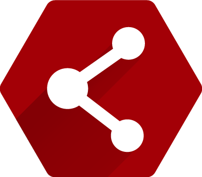

[](https://linkedin.com/in/davidgonzaleziniguez)


[dev-linkedin-badge]: https://img.shields.io/badge/Developer%20LinkedIn-David%20Gonz%C3%A1lez-0A66C2?style=for-the-badge&logo=linkedin&logoColor=white
[dev-linkedin-url]: https://linkedin.com/in/davidgonzaleziniguez

[Leer en español](README-es.md)

<br/> 

<h1> Multitec App</h1>

> **Official App of the Multitec UA student community**

<br/> 

<div align="center">
<p>
  <a href="https://flutter.dev"></a>
  <a href="https://dart.dev"></a>
  
  <a href="https://bloclibrary.dev/#/"></a>
  
</p>
</div>


Built with **Flutter**, following **Clean Architecture** and **BLoC**, integrated with **Firebase Auth**, **Cloud Firestore**, and **Sembast**.

Multitec App gives Multitec UA members a simple way to keep up with the association’s activities: browse the events agenda, join/leave activities, and access your member profile anytime — even offline.

[🎬 App Showcase](#app-showcase) • [⚙️ Technology](#technology) • [🏛️ Architecture](#architecture) • [🧩 Dependencies](#dependencies) • [🗺️ Roadmap](#roadmap) • [🚀 Getting Started](#getting-started) • [📫 Contact](#contact)

---
<h2 id="app-showcase">🎬 App Showcase</h2>

<div align="center">
  <table style="border-collapse:separate; border-spacing:12px 0; table-layout:fixed;">
    <tr>
      <th style="text-align:center;">Home</th>
      <th style="text-align:center;">Agenda</th>
      <th style="text-align:center;">Details</th>
      <th style="text-align:center;">Profile</th>
      <th style="text-align:center;">My Events</th>
      <th style="text-align:center;">Login</th>
      <th style="text-align:center;">Settings</th>
    </tr>
    <tr>
      <td align="center">
        
      </td>
      <td align="center">
        
      </td>
      <td align="center">
        
      </td>
      <td align="center">
        
      </td>
      <td align="center">
        
      </td>
      <td align="center">
        
      </td>
      <td align="center">
        
      </td>
    </tr>
  </table>
</div>

---

<h2 id="technology">⚙️ Technology</h2>

- **Architecture**: Clean Architecture  
- **State management**: BLoC/Cubit  
- **Navigation**: GoRouter (nested navigation)  
- **Authentication**: Firebase Auth (Google Sign-In)  
- **Backend**: Cloud Firestore for event scheduling and participation  
- **Offline/local**: Sembast (IO/Web) for local persistence  
- **Networking/HTTP**: **Dio** + cache (`dio_cache_interceptor` + Hive store)  
- **Dependency injection**: `get_it`  
- **Localization & theme**: `gen_l10n` (EN/ES) + light/dark theme
- **Platforms**: Android · iOS · Web

---

<h2 id="architecture">🏛️ Architecture</h2>

🔸 **Clean Architecture** + **BLoC**: clear separation of concerns, low coupling, and high testability.

### Layer structure
🔹 **Data** — `datasources • dtos • repository implementations`  
🔹 **Domain** — `entities • usecases • repositories`  
🔹 **Presentation** — `cubits • screens • widgets`

```text
feature/
├── data/
│   ├── datasources/
│   ├── dtos/
│   └── repositories/
│
├── domain/
│   ├── entities/
│   ├── repositories/
│   └── usecases/
│
└── presentation/
    ├── cubits/
    ├── screens/
    └── widgets/
````


### Folder tree (summary)
>**Feature-first** structure (each feature encapsulates <code>data/</code>, <code>domain/</code> and <code>presentation/</code>)
```text
lib/
  core/
    constants/        # API/base URLs
    database/         # Sembast (IO/Web)
    di/               # Dependency injection (get_it)
    events/           # Event bus
    exceptions/       # Failures, exceptions, reporting & guard clauses
    l10n/             # ARB + gen_l10n
    network/          # Dio clients, cache, interceptors
    preferences/      # SharedPreferences
    router/           # GoRouter + nested shell
    ui/               # Design system, theming, reusable components
    utils/            # Common helpers & extensions

  features/
    auth/
    home/        
    schedule/         
    user/                   
    profile/
    settings/

  bootstrap.dart
  main_development.dart
  main_staging.dart
  main_production.dart
```

---
<h2 id="dependencies">🧩 Dependencies</h2>

**State management**
- `bloc` + `flutter_bloc`

**Routing**
- `go_router` 

**Persistence**
- `sembast` + `sembast_web` 
- `shared_preferences` 

**Firebase**
- `firebase_core`, `firebase_auth`, `cloud_firestore`

**DI**
- `get_it` 

**Serialization / Modeling**
- `freezed`, `freezed_annotation`, `json_serializable` 

**Networking / Cache**
- `dio`
- `dio_cache_interceptor` + `dio_cache_interceptor_hive_store` 

**Utilities**
- `multiple_result` 
- `event_bus`
- `flutter_localizations` 
- `url_launcher`

**Testing & Code Quality**
- `bloc_test`
- `mocktail`
- `very_good_analysis`

**Automation & Productivity**
- `husky`, `commitlint_cli`
- `mason_cli`

---
<h2 id="roadmap">🗺️ Roadmap</h2>

- [ ] NFC member card to access the association’s space
- [ ] Online voting system for board elections
- [ ] Push notifications for announcements and event reminders
- [ ] Chat for long-term activities or events
- [ ] Suggestion box module

---

<h2 id="getting-started">🚀 Getting Started</h2>

### Downloading and installing project 🧑‍💻

Clone the project repository (choose one):

```sh
# Using SSH
git clone git@github.com:Multitec-UA/multitec-app.git
```

or

```sh
# Using HTTPS
git clone https://github.com/Multitec-UA/multitec-app.git
```

Then, navigate into the project folder:

```sh
cd multitec-app
```

Install **FVM** (Flutter Version Management) globally to manage Flutter SDK versions easily:

```sh
dart pub global activate fvm
```

Use FVM to install the Flutter version specified in the `.fvmrc` file (this installs Flutter locally to the project):

```sh
fvm install
```

> ⚠️ After running `fvm install`, it is likely necessary to restart VSCode or at least its terminal for the changes to take effect and for VSCode to use the FVM-installed Flutter version properly.

### Downloading and installing project dependencies ✨

Fetch all packages:

```sh
fvm flutter pub get
```

Finally, install Husky git hooks:

```sh
fvm dart run husky install
```

### Using Mason bricks 🧱

This project uses [Mason](https://pub.dev/packages/mason_cli) to generate feature folders inside `lib/features` following the standard structure.

Install Mason CLI:

```sh
dart pub global activate mason_cli
```

To generate a new feature, run:
```sh
mason make feature
```

---

<h2 id="contact">📫 Contact</h2>

<div align="center">

👨‍💻 **Developed by [David González Íñiguez](https://linkedin.com/in/davidgonzaleziniguez)**  

📧 [davidgab08@gmail.com](mailto:davidgab08@gmail.com)  
🔗 [linkedin.com/in/davidgonzaleziniguez](https://linkedin.com/in/davidgonzaleziniguez)

<br/>

⭐️ If you like this project, consider giving it a star!  
💬 Open to collaborations and Flutter opportunities.

</div>


<!-- MARKDOWN LINKS & IMAGES -->
<!-- https://www.markdownguide.org/basic-syntax/#reference-style-links -->
[linkedin-shield]: https://img.shields.io/badge/-LinkedIn-black.svg?style=for-the-badge&logo=linkedin&colorB=555
[linkedin-url]: https://linkedin.com/in/davidgonzaleziniguez
